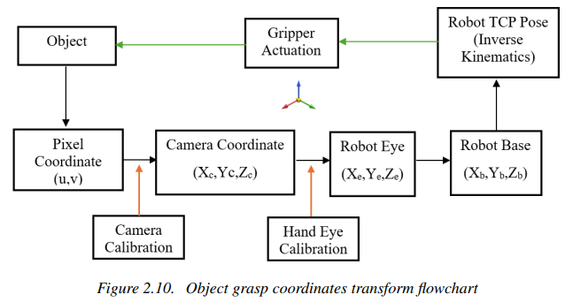
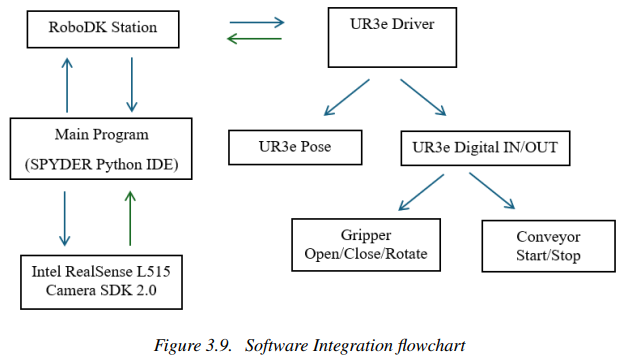
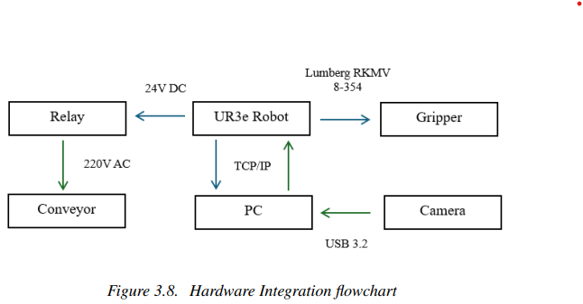
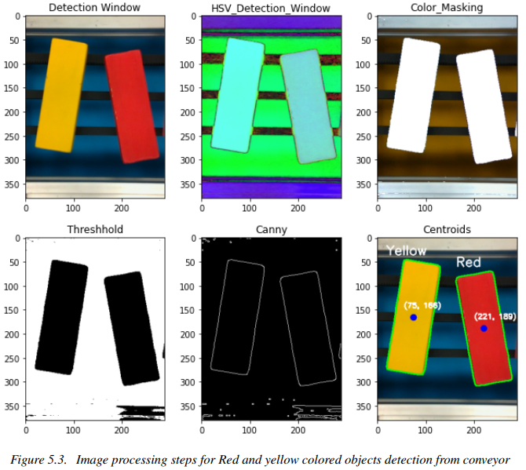
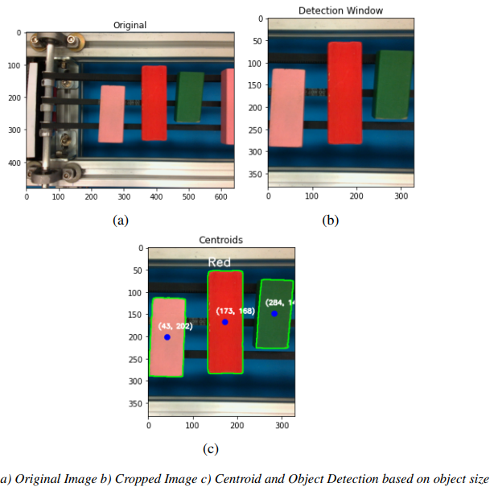
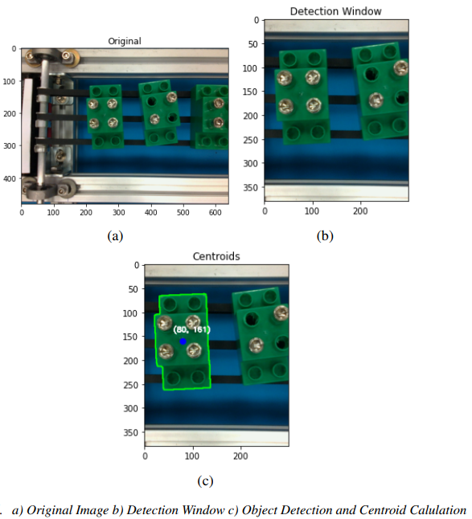
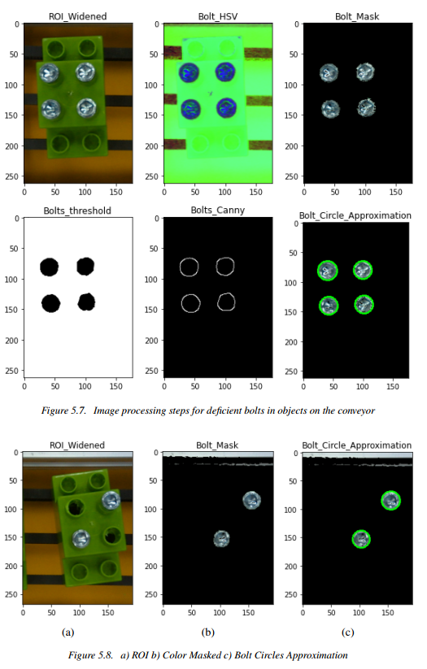

# Master_Thesis_UR3e
**Topic: Vision Guided 6-Axis Robotic Arm For Object Detection on a Conveyor Line**  

Universidad de Oviedo  
International Postgraduate Center  
Master in Mechatronics Engineering (EU4M)  
Defended on July 2024  

This work presents an small industrial setup replica for inspection and rejection of objects on a conveyor line. It explains the stepwise calibration of an Intel RealSense L515 RGBD camera and Hand
to Eye Calibration of a UR3E robot and accuracy validation based on practical tests. 

It includes the design and integration of a conveyor system with the robot and cameragripper assembly to perform pick and place operation based on Image (2D) to World (3D) coordinate transformations and various image processing techniques. Three different conveyor inspection scenarios are replicated to detect the objects on the basis of size, color and deficient bolts and integrated on a single program with online visualization of results.

Below is the images for the digital twin setup and the original setup of the robotic cell. 

   

  

Below shown is the concept flow chart for conversion of 2D pixel coordinates to 3D robot world coordinates.

  

Hereby, I share my Final report, Presentation and Complete code (include in the Final Report_Appendix) in this repopsitory for your reference to build up on project concept and carry out improvements and in case of any questions feel free to contact me.

# Objectives

Primary:
1. Develop and Integrate a Vision-guided robotic system for the purpose of Inspection and Classification.
2. Design and Integration of a Robotic Cell: Conveyor system with UR3E Robot.
3. Develop Object-Detection algorithm for classification and pick-place action.

Secondary:
1. Optimize Camera and Hand-eye calibration for accurate operation.
2. Improvement of Detection and Inspection algorithm in a dynamic scenario.

# Kurzübersicht
To save your time, I provide a small glimpse of topics covered in the project for your aid:

1. Overview of different Coordinate System in use and its Transformation (Translation and Rotation)
2. Camera Intrinsics Concept and its Calibration (Code inc.)
3. Camera Extrinsics Concept and Hand-eye-calibration (Code inc.)
4. System Design (Software and Hardware Integration)
5. Conversion of 2D pixel co-ordinates to 3D World coordinates (Code inc.)
6. Image Processing Algorithm detailed explanation to reject defective objects on conveyor (Based on size, color and deficient bolts) (Code inc.)
7. Video 1: For Camera calibration accuracy check and Coordinate conversion (2D to 3D)
8. Video 2: Final outcome showing the three different Object detection and pick_place scenarios

# Software and Hardware Integration Flowchart

Below is the Software and Hardware Integration flowchart for the designed robotic cell. 

  

  

  

# Results for Different Scenarios

1. Detection and Rejection based on Object Colour  
   **Threshhold value: Average RGB**

  

2. Detection and rejection based on Object Size  
   **Threshhold value: Object contour Area**

  

3. Detection and rejection based on deficient bolts present on the object  

Stage 1: Detection of Objects  
   **Threshhold value: Color Mask and Contour Area**

  

   
Stage 2: Detection of Bolts  
   **Threshhold value: Color Mask and Bolt circle Approximation**

  

**Thank you for your time and don't forget to check out the video to see the project in action.** [Watch the video](./Inspection_Conveyor_UR3E_Integration_Video.mp4)  

Have a good day! 
  

